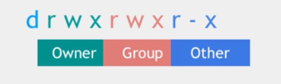
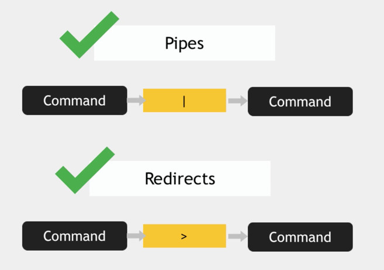
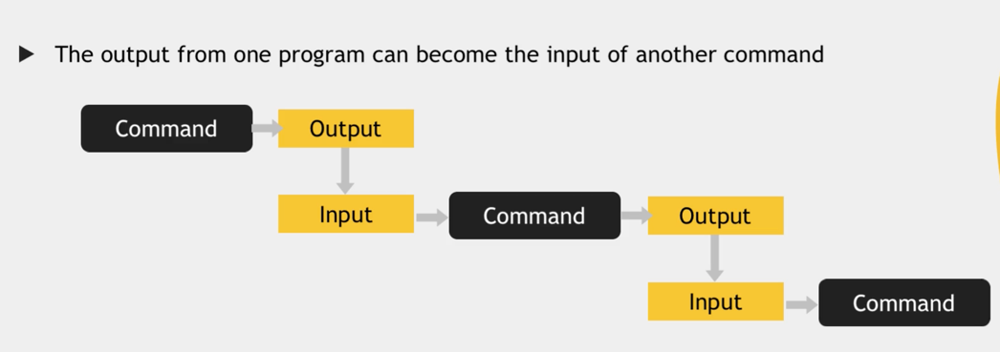
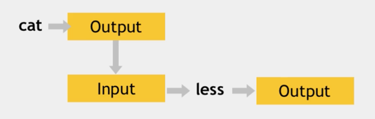
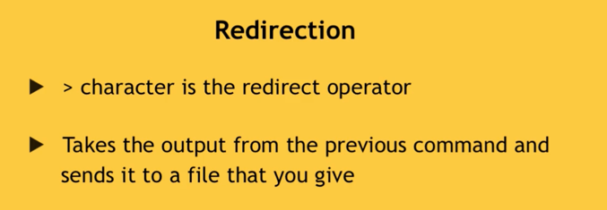
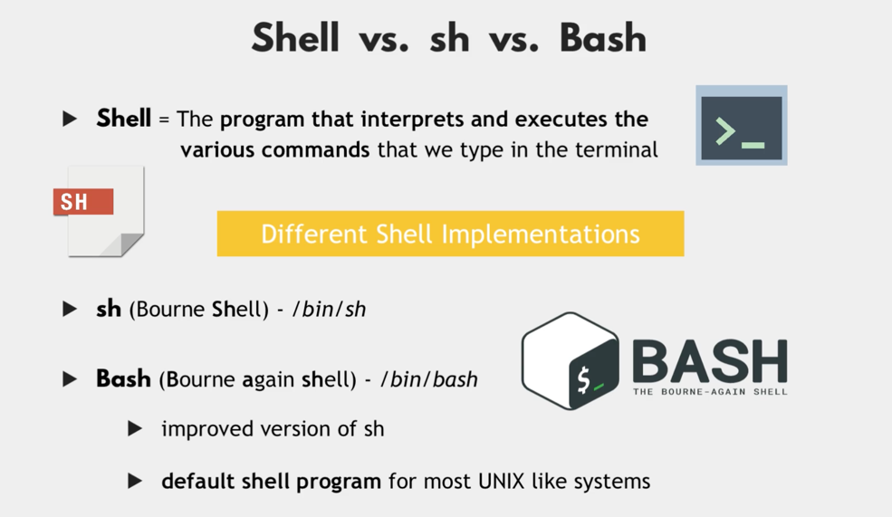
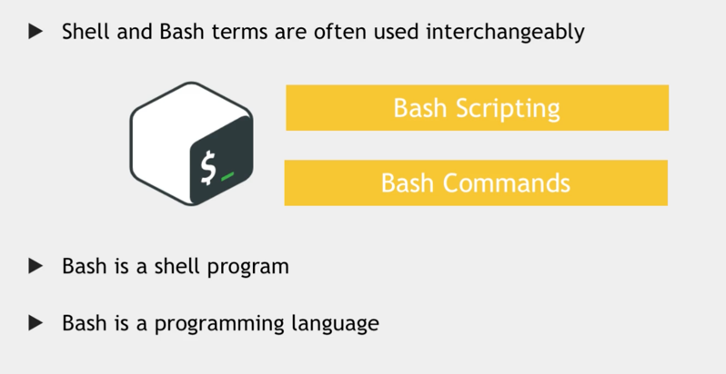
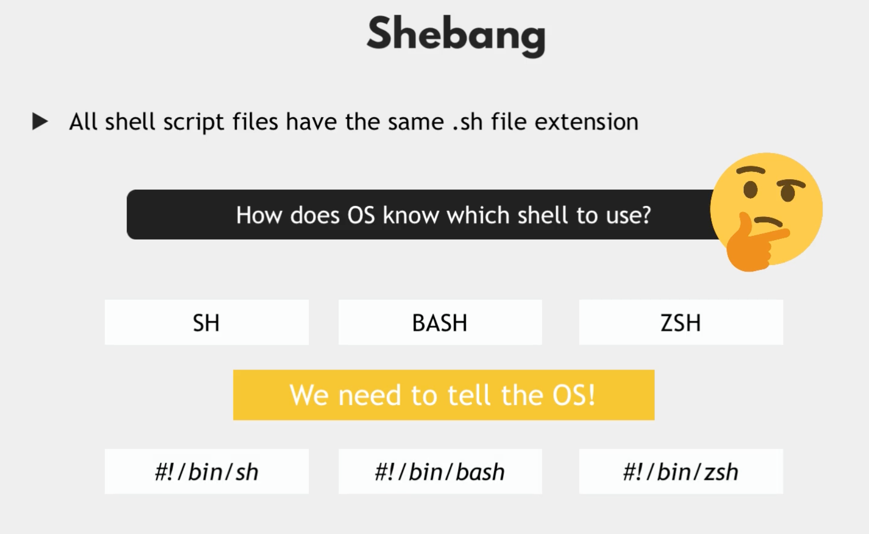

# DevOps-BC
## ToC
- [Linux vs. Microsoft Filesystem](#os)  
- [CLI Commands](#cli)
- [Package Manager](#manager)
- [Vim Editor](#vim)
- [Linux Accounts & Groups - Users Management](#users)
- [Linux Accounts & Groups - Users Permission](#users-permission-2)
  - [Ownership](#lx-owner)
  - Permissions
    - [with Symbols](#lx-permission-sb)
    - [with octal numbers](#lx-permission-num) (preferred way)
- [Basic Linux Commands - Pipes & Redirects](#basic-commands)
- [Introduction to Shell Scripting](#sh-scripting)
  - [Variables](#sh-scripting-variables)


# Linux File System vs. Microsoft <a id="os"></a>
We have a hierarchical tree structure
We have `1 root folder`.
```
root/
├── bin/
├── etc/
├── opt/
└── var/
```

#### Compared in Windows.
We have `multiple root folders`.
```
C:\
├── Program Files\
├── Users\
├── Windows\
├── bin\
├── etc\
├── opt\
└── var\
```

## Linux Folders

### `/bin`
- executables for most essential user commands.
- available system-wide for all users

### `/sbin`
Are for 'system binaries'
- used for Administrators and for the system itself.
- These binaries need a superuser permission for execution.

### `/lib`
Hold the libraries for that executables from `/bin` or `/sbin`.

### `/usr`
Comes from the older times, where storage was important. Less important nowadays.
The `root /bin and /sbin` have less commands.  
Inside the /usr folder we have a `/local` folder.  
Third Party Applications **that WE install** on the computer, will be placed in here. -> `/usr/local/` like Java, Docker...  
- programs installed here, will be **available for all users on the computer**.  
- **If only we as the current user** want to have this program installed, we have to install it in the users `/home folder`.

### `/opt`
Programs in here, will be system-wide available for all users.  
There are some programs, that don't split their app into binaries and libraries.
Differences between `/opt` and `/usr/local`:
- `/usr/local` Programs, which split its components
- `/opt` Programs, which **NOT** split its components.  

### `/boot`
Contains files required for booting.
**We should not touch this folder**.

### `/etc`
Here we can `read and write`.  
Here is the system configuration stored and the main configuration location.  
Like Network, Linux user data, passwords, php config...

### `/dev`
Location of device files, like webcam, keyboard, hard drives etc.
- apps and drivers will access this, **NOT** the user.
- all files that the system needs to interact with the device.

### `/var`
Log files, cached data from applications.
- `/var/log` contains log files
- `/var/cache` contains cached data from application programs

### `/tmp`
Stores temp files for different applications.
### `/media` and `/mnt`
- /media where external media is mounted. Like Network Drive, CD, USB etc. They will also be referenced in the /dev folder.  
- /mnt for **manually** mounting file systems to operating system.  
### `hidden files (dotfiles)`
is primarily used to help prevent important data from being accidentally deleted.  
Are used to execute some scripts, store config etc.
- automatically generated py programs or operating system.
- File name **starts with a dot**
- in UNIX called "dotfiles"
- are usually stored in `/home folder`. for the current user.

---

# CLI Commands <a id="cli"></a>
### user and machine
```
name@name-ubuntu: ~$
```
- `name` is our logged-in user.
- `name-ubuntu` is our computer name.
- `~` current directory is home.
- `$` the dollar sign means "regular user"
- If we are logged in as a `root user` the dollar sign would be a hashtag instead `#`
## Basic Linux Commands
Everything in Linux is a file, if it is a document, pictures, directories, commands like pwd, ls etc.

#### Go to folders:
- root folder `/` (we should **not** change anything in here)
  - go to a specific folder `/$` and we can define an absolute path `cd /usr/local/bin`
- home folder `~`

### Flags
- `-r` does operation recursively
  - usage: 
    - file and folder deletion.
### Directory Operations:
- get current directory:
  - `pwd`
- list folders and files
  - `ls`
  - `ls -a` list all, incl. hidden files / folders.
- change directory
  - `cd [dir name]` example `cd Documents`
  - `cd ..` go up one level in the hierarchy.
- create folder
  - `mkdir [folder name]` example `mkdir python-project`
- remove folder
  - `rmdir [folder name]` example `rmdir python-project`
  - `rm -r [folder name]` to delete a **non-empty** folder with all its content.
  - `rm -d [folder name]` delete **empty directory**
- copy folder
  - `cp -r [original folder] [new folder]` example `cp -r java-app my-project` (To move the content with it, we need to add the -r flag.)
- rename folder
    - `mv [original name] [new name]` example `mv web-app java-app`
### File Operations:
- create file
  - `touch [filename]` example `touch main.py`
- remove file
  - `rm [filename]` example `rm main.py`
  - `rm -r [filename]` example `rm -r main.py`
- rename file
  - `mv [original name] [new name]` example `mv web-app java-app`
- copy file
  - `cp [filename] [new filename]` example `cp Readme.md NewReadme.md`
- display hidden files
  - `ls -a` show all files and folders including hidden ones.
- display content from a file
  - `cat [filename]` stands for concat

### Helpful commands
- Show contents from folders
  - `ls -R Documents`
- show history file 
  - `history` this gives us a list of all past commands typed in the current terminal session.
- search history
  - `CTRL + r` reverse search from history
- stop current command
  - `CTRL + c`
- copy and paste into terminal
  - `CTRL + SHIFT + V` paste copied text into terminal
- get kernel info, os version
  - `uname -a`
- get os release file info
  - `cat /etc/os-release`
- get information about installed hardware
  - `lscpu` for cpu
  - `lsmem` for memory
- change user
  - `su - [username]` example `su - admin`
- logout current user
  - `exit` 
### Superuser
- add user
  - `sudo adduser [name]`
- add group
  - `1 sudo addgroup devops`
---

# Package Manager <a id="manager"></a>
There are two common ways to install software in linux.
### Using APT
We should use `APT` and **not** `APT-GET`
#### Apt Commands
- search for package
  - `apt search [packagename]` example `apt search openjdk`
- install package
  - `sudo apt install [packagename]`
- remove package
  - `apt remove [packagename]`
### Using Snap

---

# Vim Editor<a id="vim"></a>
### Install Vim
We use the cli for this `sudo apt install vim`
### Vim CLI Commands
- create new file and use vim editor
  - `vim config.yaml` if the file does not exist, it will create it as well.

### Normal Mode `n`
- delete entire line `dd`
- delete next lines below `d[number]`
- undo changes `u`
- jump to end of line `A` or `$`
- jump to start of line `I` or `0`
### Command Mode `:[command]`
- write file and quit vim `:wq`
- jump to line `[lineNumber]G`
- Search `/[pattern]` example `/nginx`
- jump to next occurrence `n`
- replace old string with new string `:%s/old/new`

### Insert Mode `i`


---
# Linux Accounts & Groups <a id="users"></a>
### Users Management
stores user account information:
- `/etc/passwd` everyone can read it, but only the root user can change the file.
  - `cat /etc/passwd` this prints out a list of all users on the system.
```
sirstich:x:1000:1000:bernhard:/home/sirstich:/bin/bash
USERNAME : PASSWORD : UID : GID : GECOS : HOMEDIR : SHELL 
```
Username - Used when user logs in  
Password - `x` means, that encrypted password is stored in `/etc/shadow file`  
User ID (UID) - each user has a unique ID, UID 0 is reserved for root.  
Group ID (GID) - the primary group ID (stored in `/etc/group file`)  
User ID Info - Comment field for extra information about users
GECOS - a commented field about the user
HOMEDIR - Absolute path of users home dir
Shell - Absolute Path of a shell
### Manage Users from CLI
- add user
  - `sudo adduser [username]`
- change users password
  - `sudo passwd [username]`
- switch user
  - `su - [username]`
- switch to root user
  - `su -`
- remove user
  - `deluser [username]`
- create new group
  - `groupadd devops`
    - to print out our groups we can use `cat /etc/group`
- change primary group of a user
  - `sudo usermod -g [groupname] [username]` example `sudo usermod -g devops tom`
- overwrite subgroups to user
  - `sudo usermod -G [groupname1, groupname2] [username]` example `sudo usermod -G admin,othergroup tom` (Note that the `-G` will overwrite the existing group list.)
- add subgroups to user
  - `sudo usermod -aG [groupname] [username]` example `sudo usermod -aG newgroup tom` (Note: This will **append** this group to the user.)
- remove user from group
  - `sudo gpasswd -d [username] [groupname]`
- print out the groups for the current logged-in user
  - `groups`
- print out the groups for any user
  - `groups [username]`
### Manage Users from Scripts
When we want to have automation, we should use the commands suffixed by `add`.  

Commands:
- `useradd`
- `groupadd`
- `userdel`
- `groupdel`
## User Permissions <a id="users-permission-2"></a>
### Ownership <a id="lx-owner"></a>
- print files in a long listing format to see all information
  - `ls -l` this will give as an output `-rw-r--r--  1 bernhard  staff    790 Jul  9 18:08 README.md`
    - explanation for output:
      - `bernhard` is the owner
      - `staff` is the primary group from that user
- change ownership of file for user and group
  - `chown [username]:[groupname] [filename]` we use the `primary group` from that user. example `sudo chown tom:admin test.txt`.
- change ownership file for user
  - `chown [usernmae] [filename]` when we only want to change the user, we don't need to provide the group.
- change ownership of file for group
  - `chrgp [groupname] [filename]`
### File Permission
We can see the current permissions when we run `ls -l`, this will give us the list of what are the owner, group and the permissions for the current file.
```shell
# output like this when we ran `ls -l`
drwxr-xr-x  3 bernhard  staff     96 Jul  9 18:08 migrations
```
  
#### First Character is for File Type⤴️
`-` means regular file  
`d` means directory  
`c` means character device file  
`l` means symbolic link  
#### Second Block (green) is for user
`r` readonly access  
`w` write access  
`x` execute access  
#### Third Block (red) is for group
`r` readonly access  
`w` write access  
`x` execute access  
#### Fourth Block (blue) is for other
`r` readonly access  
`w` write access  
`x` execute access  
#### No Permission
`-` no permission is represented as a dash  

### Modify Permissions <a id="lx-permission-sb"></a>
For this we use the `chmod` command.
#### User, Owner or Other targeting flags (target-flag)
```shell
u- # user
g- # group
o- # other
```
#### Read, Write or Execute Permission flags (permission-flag)
operator: 
- `-` to remove permission
- `+` to add permission
```shell
chomd [target-flag][operator][permission-flag] [filename]
# full example `chmod u+w filename`

u-r # remove read permission
g+w # add group permission (primary group)
o-x # remove execute permission for others


# or we can use multiple selection
sudo chmod a=r-- filename # a is for all affected
# only for group
sudo chmod g=rw- filename # g is for group and we add write and read
# only for user
sudo chmod u=rw- filename # g is for group and we add write and read
```
#### Shorthand for permission - using octal numbers <a id="lx-permission-num"></a>
using octal number:
- `0` no permission
- `1` execute permission
- `2` write permission
- `4` read permission
- `7` all permissions  
Example: **Read** and **Write** for **User** (4 + 2 = 6), read for group and other (4)
  - `chmod 644 filename.txt`
```shell
# first run 
ls -l # to see the current permissions
# for hidden files we use `ls -la`
chomd 777 [filename]
# full example `chmod 777 filename.txt`
chmod 775 # all permissions for user, read and execute for group and other.
chmod 644 # read and write for user, read for group and other

u-r # remove read permission
g+w # add group permission (primary group)
o-x # remove execute permission for others
```
- read files current permission 
  - `ls -l`
  
---
# Basic Linux Commands - Pipes & Redirects  <a id="basic-commands"></a>

### Standard I/O
Every Program has 3 built-in streams:
- STDIN (0) = Standard Input
- STDOUT (1) = Standard Output
- STDERR (2) = Standard Error

### Passing input to output

### Using `less` tool
`'less' displays the contents of a file or a command output. One page at a time.`  
Mostly used for opening large files, as less doesn't read the entire file, which results in faster load times.  
We use the `pipe` command: `|`  
Pipes the output of the previous command as an input to the next command  
```shell
cat /var/log/syslog | less
```
### Filter output - using `grep` tool
We use `grep` for this  
`grep` stands for Globally Search for Regular Expression and Print out.  
Searches for a particular pattern of characters and displays all lines that contain that pattern.
```shell
history | grep [searchCriteria]
# example
history | grep sudo // this will search for any input with sudo
# search for a sentence, we need " " quotes
history | grep "sudo chmod"
```
### Redirects in Linux

We can take the output from the previous command and send it to a file
```shell
history | grep sudo > sudo-commands.txt # > will replace the content
# if we want to append to the end of the file we use >>
history | grep rm >> sudo-rm-commands.txt
```
# Introduction to Shell Scripting <a id="sh-scripting"></a>
Shell scripts have a `.sh` file extension
### Shell vs. sh vs. Bash


### Create a simple bash script
```shell
touch setup.sh
```
### `Shebang Line` - Tell the OS which shell it should execute

We have to write the `shebang` in the first line in our script.  
The Shebang line points to the absolute path to the bash program.
```shell
# to check if the bash exists
ls /bin | grep bash
```
### Execute Shell Script
Before we can run the shell script, we have to change the `permission` of the file.
Because by default, we don't have an execute permission.
```shell
# here we add the execute permission only for the current user.
sudo chmod u+x setup.sh
# check permission
ls -l setup.sh
# if the color of the file changed, this is now an executable
# - execute setup.sh file
./setup.sh # this is how we execute ANY shell script, no matter what syntax
# or if we want to run this for bash specific
bash setup.sh
```
### Shell Variables <a id="sh-scripting-variables"></a>
- Define a variable
  - `file_name=config.yaml` Here we assign the string config.yaml to file_name
- Access variable
  - `$file_name` We use the `$` sign
- Store output of a command in a variable
  - `variable_name=$(command)` We also can store the output from another command
  

#### Conditionals
- if else
```shell
#!/bin/bash
file_name=config.yaml

if [ -d "config" ] # this will check if there is a directory named config
then
  echo "reading config directory contents"
  config_files=$(ls config)
else
  echo "config dir not found. Creating one"
  mkdir config
fi # reverse of if, the program
```
#### File Test Operators & Permission Operators
- `-b file` Checks if file is a block special file, if yes, then condition become true.
- `-c file` Checks if file is a character special file; if yes, then the condition becomes true.
- `-d file` Checks if file is a directory; if yes, then the condition becomes true.
- `-f file` Checks if file is an ordinary file as opposed to a directory or special file; if yes, then the condition becomes true.
- `-g file` Checks if file has its set group ID (SGID) bit set; if yes, then the condition becomes true.
- `-k file` Checks if file has its sticky bit set; if yes, then the condition becomes true.
- `-p file` Checks if file is a named pipe; if yes, then the condition becomes true.
- `-t file` Checks if file descriptor is open and associated with a terminal; if yes, then the condition becomes true.
- `-u file` Checks if file has its Set User ID (SUID) bit set; if yes, then the condition becomes true.
- `-r file` Checks if file is readable; if yes, then the condition becomes true.
- `-w file` Checks if file is writable; if yes, then the condition becomes true.
- `-x file` Checks if file is executable; if yes, then the condition becomes true.
- `-s file` Checks if file has size greater than 0; if yes, then the condition becomes true.

#### Relational Operators - Works only for numeric values
- `-eq` Checks if the value of two operands are equal or not; if yes, then the condition becomes true.
- `-ne` Checks if the value of two operands are equal or not; if values are not equal, then the condition becomes true.
- `-gt` Checks if the value of left operand is greater than the value of the right operand; if yes, then the condition becomes true.
- `-lt` Checks if the value of left operand is less than the value of the right operand; if yes, then the condition becomes true.
- `-ge` Checks if the value of left operand is greater than or equal to the value of the right operand; if yes, then the condition becomes true.
- `-le` Checks if the value of left operand is less than or equal to the value of the right operand; if yes, then the condition becomes true.

#### String Operators
```shell
#!/bin/bash
echo "Setup and configure server"

user_group="nana" 

if [ "$user_group" == "nana" ]
then
	echo "configure the server"
else
	echo "No permission to configure server. wrong user group"
fi

```
#### Positional Parameters
When we want to run our script with some args, we can access them in order by using `$1`.
```shell
# access
user_group=$1
# calling script
bash setup.sh admin # here admin is the parameter we want to access.
```


